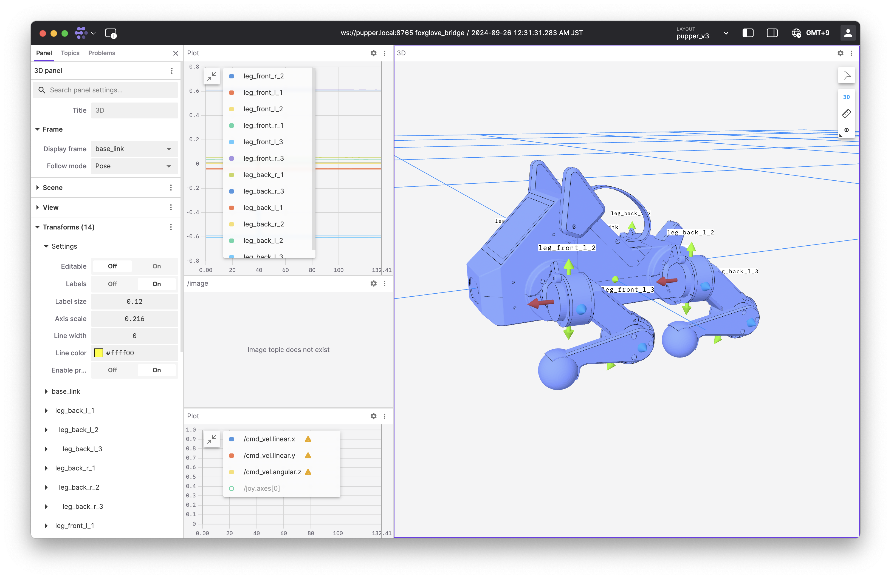

Visualization using Foxglove Studio
===============================================

Steps
-----

#. Download Foxglove Studio to your personal computer `Foxglove Studio Download <https://foxglove.dev/download>`_.
#. SSH to Pupper with 

    ``ssh -L 8765:localhost:8765 pi@pupper.local``

#. On Pupper, run the stack

    ``ros2 launch neural_controller launch.py``
    
#. Open Foxglove Studio on your personal computer and choose "Open connection".
#. Connect to ``ws://pupper.local:8765``.
#. Download my `Foxglove layout file <https://github.com/HandsOnRobotics/pupper-v3-documentation/blob/master/docs/data/pupper_v3.json>`_ to your personal computer (it sets up the viewers and panels nicely).
#. Load my Foxglove layout file by going to LAYOUT in the top right corner, and choosing the file.   
#. Enjoy!

