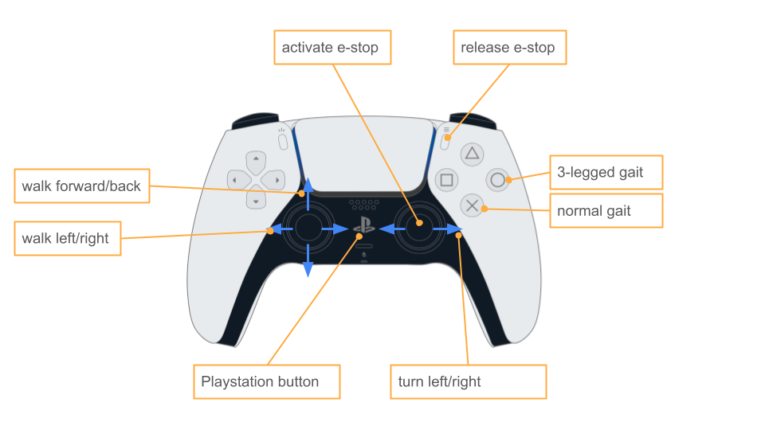

=================
Operation
=================

Robot controls
---------------

Running the robot
-----------------
#. Insert the DeWalt battery. Press the black latch as you slide the battery in and release it. 
   You should feel the latch lock into place once the battery is far enough inside the robot. 
   
    [TODO: add picture/video]

#. Power on the robot by pressing switch on the back of the robot. 
    
    [TODO: add picture]

Robots that automatically launch the stack (default)
^^^^^^^^^^^^^^^^^^^^^^^^^^^^^^^^^^^^^^^^^^^^^^^^^^^^^
#. Allow the robot to complete calibration. 
   The robot should move its legs until they hit their endstops and then move back into a resting position. 
   
    [TODO: add picture/video]

#. Turn on the controller by pressing the Playstation logo button. Once it's connected to the robot two blue lights and a white light will shine like this:
    
     .. image:: ../_static/operations/connected_ds.png
                :align: center
                :scale: 25%

#.  Press the "release e-stop" button as shown in the image above to activate the walking policy. 
    Note that you will need to wait a few seconds after the legs finish calibration for pressing the e-stop release to be effective. 
    Feel free to keep pressing the button until the robot activates.

#.  Note that the robot does not have a hardware low-voltage cutoff so please be careful not to run the robot longer than 40 minutes. 
    You can check the battery level by turning off the robot (e-stop switch on back), taking out the battery, and pressing the button on the battery.

Robots that require stack to be manually launched (development mode)
^^^^^^^^^^^^^^^^^^^^^^^^^^^^^^^^^^^^^^^^^^^^^^^^^^^^^^^^^^^^^^^^^^^^^
#. Connect to robot
    #. Option 1: Keyboard and mouse
        #. Connect a keyboard and mouse to the robot.
    #. Option 2: SSH to robot
        #. SSH to robot::

            ssh pi@pupper.local

#. Open terminal on the robot (control-alt-t)
#.  Run the following command to launch the stack::

        ros2 launch neural_controller launch.py

    Trouble shooting: If there is an error that ``neural_controller`` is not found, run the following command:

    #. Build the code again by running::

        ~/pupperv3-monorepo/ros2_ws/build.sh

    #. And source workspace by running::

        source ~/pupperv3-monorepo/ros2_ws/install/local_setup.bash

    #. Try launching stack again as before
    
#. Continue following the instructions above for robots that automatically launch the stack.

Hosting WiFi network on Pupper (AP mode)
----------------------------------------

This allows you to connect to Pupper's WiFi network and control it from your computer. This is useful when you don't want to connect directly with an ethernet cable.

#. Plug in a keyboard and mouse to Pupper and use the GUI to create a WiFi network.

    .. image:: ../_static/ap_mode/create_network.png
            :align: center

#. Set the network name and password. Click "Create".

    .. image:: ../_static/ap_mode/enter_details.png
            :align: center

#.  On your own computer, connect to the Pupper WiFi network you just created. Now you can SSH to the robot as usual::

        ssh pi@pupper.local

    or::
        
        ssh -LA 8765:localhost:8765 pi@pupper.local
    
    if you want to use Foxglove Studio and pass through git credentials (``-A``).

#. Optionally, you can configure the Pi to automatically start the network on startup.

    #. Edit connection
        .. image:: ../_static/ap_mode/edit.png
                    :align: center
    #. Edit settings
        .. image:: ../_static/ap_mode/gear.png
                    :align: center
    #. Enable auto connect
        .. image:: ../_static/ap_mode/connect_auto.png
                    :align: center