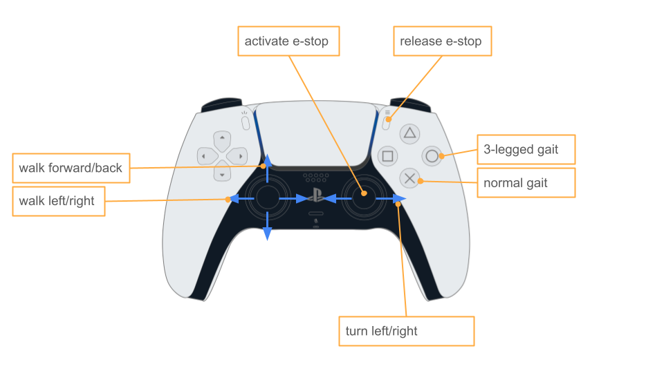

=================
Operation
=================

Running the robot
-----------------
#. Insert the DeWalt battery. Press the black latch as you slide the battery in and release it. You should feel the latch lock into place once the battery is far enough inside the robot. [ADD PICTURE/VIDEO]
#. Power on the robot. Press the E-STOP switch on the back of the robot. [ADD PICTURE]

Robots that require stack to be manually launched
^^^^^^^^^^^^^^^^^^^^^^^^^^^^^^^^^^^^^^^^^^^^^^^^^^
#. Connect keyboard and mouse
#. Open terminal on the robot (control-alt-t)
#. Run the following command to launch the stack:

    ``ros2 launch neural_controller launch.py``

    Trouble shooting: If there is an error that ``neural_controller`` is not found, run the following command:

    #. Build the code again by running
    
        ``~/pupperv3-monorepo/ros2_ws/build.sh``

    #. And source workspace by running
    
        ``source ~/pupperv3-monorepo/ros2_ws/install/local_setup.bash``

    #. Try launching stack again as before
    
#. Continue to next instructions

Robots that automatically launch the stack
^^^^^^^^^^^^^^^^^^^^^^^^^^^^^^^^^^^^^^^^^^^
#. Allow the robot to complete calibration. The robot should move its legs until they hit their endstops and then move back into a resting position. [ADD VIDEO]

Robot controls
---------------

Hosting WiFi network on Pupper (AP mode)
----------------------------------------

This allows you to connect to Pupper's WiFi network and control it from your computer. This is useful when you don't want to connect directly with an ethernet cable.

#. Plug in a keyboard and mouse to Pupper and use the GUI to create a WiFi network.

    .. image:: ../_static/ap_mode/create_network.png
            :align: center

#. Set the network name and password. Click "Create".

    .. image:: ../_static/ap_mode/enter_details.png
            :align: center

#. Optionally, you can configure the Pi to create the network on startup.

    #. Edit connection
        .. image:: ../_static/ap_mode/edit.png
                    :align: center
    #. Edit settings
        .. image:: ../_static/ap_mode/gear.png
                    :align: center
    #. Enable auto connect
        .. image:: ../_static/ap_mode/connect_auto.png
                    :align: center